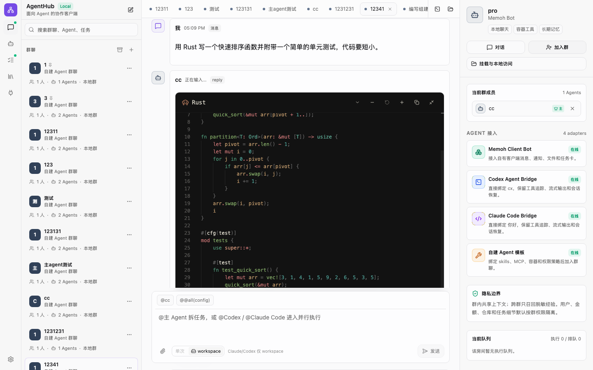
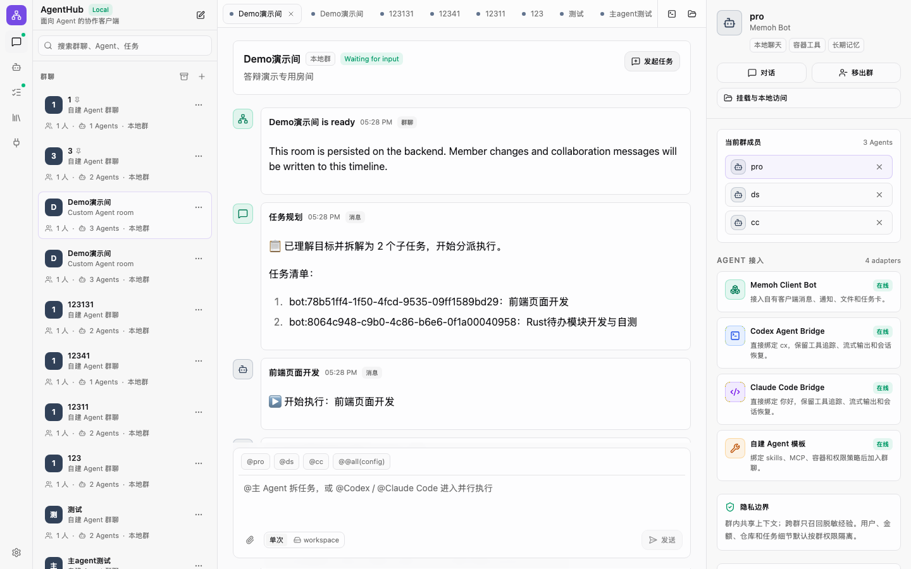
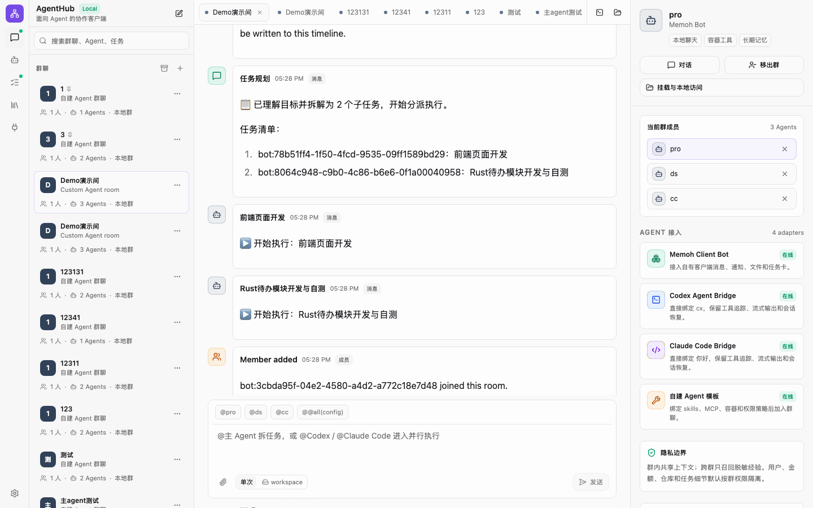
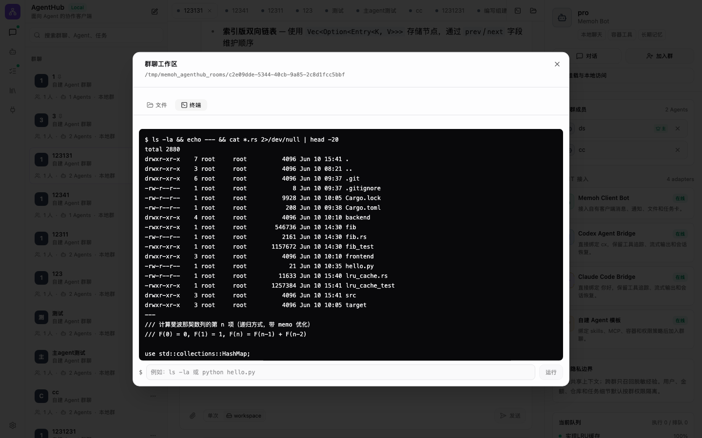

# AgentHub — 多 Agent 协作平台

> AI 全栈挑战赛参赛作品 · 小组 **启灵**(齐紫瀚、熊子恒、张桐铖)
>
> English version: [README.md](README.md)

AgentHub 把「驱动一组 AI Agent 干活」做成像发微信一样自然的 IM 协作体验:Agent 即群成员,@ 主 Agent 自动拆解分派、或 @ 具体成员点名干活,产物落在群共享工作目录,协作过程在聊天流全程可见。平台统一接入多种 Agent —— **memoh**(自建框架型,本仓库内置的一种 agent)、**Claude Code**、**Codex**(CLI 型),由统一适配器层与编排内核(Orchestrator DAG)协调。

本仓库基于 memoh 全栈平台(Go 后端 + Vue Web + Electron 桌面 + 容器化 Agent 工作区)开发;AgentHub 是其中的多 Agent 协作能力,memoh 是平台内置的一种 agent。

---

## 📦 交付物(三份文档)

最终交付的三份文档在 [`deliverables/`](deliverables/) 下(PDF):

| 文档 | 文件 | 内容 |
|---|---|---|
| 产品设计文档 | [`agenthub-product-design.pdf`](deliverables/agenthub-product-design.pdf) | 产品定位、群聊心智、多 Agent 失效模式与应对、目标用户与典型场景、核心体验决策、功能矩阵、路线图 |
| 技术文档 | [`agenthub-technical-design.pdf`](deliverables/agenthub-technical-design.pdf) | 分层架构、数据模型(完整 DDL)、编排状态机与调度、双层 Planner、统一适配器层、凭证解析链、事件投影、三条核心链路时序、HTTP API、测试门禁 |
| AI 协作开发记录 | [`agenthub-ai-collaboration.pdf`](deliverables/agenthub-ai-collaboration.pdf) | 人–AI 回合制协作模型、Rules / Spec / Plan / Skill 规范、三个深度协作案例、真实会话档案(19 会话 / 277 用户回合 / 2582 工具调用) |

### 评分维度对照

| 考察维度 | 权重 | 在哪验证 |
|---|---|---|
| AI 协作能力 | 30% | [AI 协作开发记录](deliverables/agenthub-ai-collaboration.pdf) + git log(R1–R9 功能 commit) |
| 功能完整度 | 25% | 按下方步骤运行 Demo;[产品设计文档](deliverables/agenthub-product-design.pdf) 功能矩阵 |
| 生成效果质量 | 20% | Demo 视频 + 下方界面截图 |
| 代码理解度 | 15% | [技术文档](deliverables/agenthub-technical-design.pdf)(架构 / 状态机 / 时序)+ `internal/agenthub/**` |
| 创新与产品感 | 10% | 产品文档:失效模式应对、pin 长期上下文、共享工作区、实时过程气泡 |

---

## 🎬 Demo 视频(3 分钟)

夸克网盘:**<https://pan.quark.cn/s/4e9ebc5c07b7>** (「启灵-agent」)

---

## 🖼 界面一览

| 单聊:逐字流式 + 思考 / 工具过程 | 群聊编排:任务规划卡 |
|---|---|
|  |  |
| **运行中任务的实时过程气泡** | **群共享工作区:浏览器终端** |
|  |  |

---

## ▶️ 运行 Demo(本地)

前置依赖:**Docker / Docker Compose**、**[mise](https://mise.jdx.dev/)**(统一管理任务与 Go / Node / pnpm / sqlc 等工具版本)。

```bash
# 1. 安装依赖与工具链
mise run setup

# 2. 启动开发环境（docker compose，SQLite，自动构建）
mise run dev
```

启动后打开 Web 控制台:

```text
http://localhost:19082
```

> Web 端口可用环境变量 `MEMOH_SQLITE_DEV_WEB_PORT` 覆盖(默认 19082)。
> 停止:`mise run dev:down:sqlite`;查看全部任务(含 `dev:postgres` 等变体):`mise tasks`。

Demo 动线(单聊逐字流式、群聊自动编排的实时过程气泡、pin 置顶长期上下文、群共享工作区的文件浏览与浏览器终端)详见产品 / 技术文档。

---

## 项目概览

- **后端** Go(Echo) · **前端** Vue 3 + Vite · **桌面** Electron · **存储** SQLite / PostgreSQL · **检索** Qdrant
- **Agent 接入**:memoh(内置框架型)/ Claude Code / Codex(CLI 型),统一适配器层 + Orchestrator DAG 引擎,LLM / 规则双层 Planner
- **协作能力**:AgentHub 房间、@ 提及、共享工作目录、置顶长期上下文、事件溯源、运行中实时过程气泡、失败降级与崩溃自愈

完整架构、数据模型与核心链路时序见 [`deliverables/agenthub-technical-design.pdf`](deliverables/agenthub-technical-design.pdf)。

## 许可证

见 [LICENSE](./LICENSE)。
