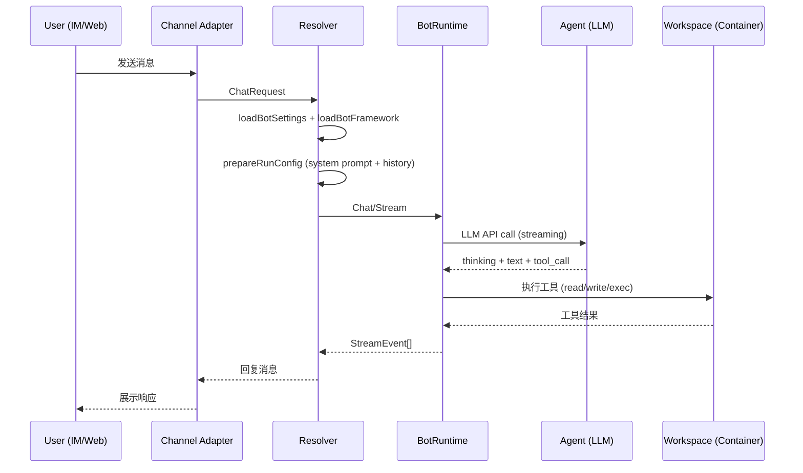
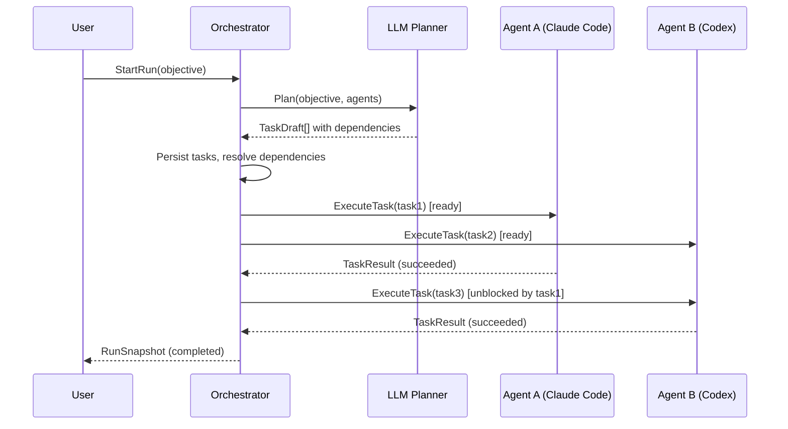

# 技术架构文档

## 1. 系统架构概览

```
┌─────────────────────────────────────────────────────────────┐
│                      客户端层                                │
│  Web UI (Vue 3)  │  Desktop (Electron)  │  IM Platforms     │
└────────┬─────────────────┬──────────────────────┬───────────┘
         │                 │                      │
┌────────▼─────────────────▼──────────────────────▼───────────┐
│                   Server (Go + Echo)                         │
│  ┌──────────┐  ┌───────────┐  ┌──────────────┐              │
│  │ REST API │  │ Channel   │  │ Conversation │              │
│  │ Handlers │  │ Adapters  │  │ Flow         │              │
│  └────┬─────┘  └─────┬─────┘  └──────┬───────┘              │
│       │              │               │                       │
│  ┌────▼──────────────▼───────────────▼──────┐               │
│  │         In-Process Agent (Twilight AI)    │               │
│  │  ┌─────────┐  ┌──────────┐  ┌─────────┐  │               │
│  │  │ Prompt  │  │ Tools    │  │ Memory  │  │               │
│  │  │ Engine  │  │ Provider │  │ System  │  │               │
│  │  └─────────┘  └──────────┘  └─────────┘  │               │
│  └──────────────────────────────────────────┘               │
│       │                                                      │
│  ┌────▼──────────────────────────────────────┐               │
│  │         Agent Hub (Orchestrator)          │               │
│  │  ┌─────────┐  ┌──────────┐  ┌─────────┐  │               │
│  │  │ Planner │  │ DAG      │  │ Agent   │  │               │
│  │  │ (LLM)   │  │ Engine   │  │ Provider│  │               │
│  │  └─────────┘  └──────────┘  └─────────┘  │               │
│  └───────────────────────────────────────────┘               │
└──────────┬──────────────────────────┬────────────────────────┘
           │                          │
┌──────────▼──────────┐    ┌──────────▼──────────┐
│ PostgreSQL / SQLite │    │ Workspace Container │
│ (数据持久化)         │    │ (gRPC Bridge + UDS) │
└─────────────────────┘    └─────────────────────┘
           │
┌──────────▼──────────┐
│ Qdrant (向量数据库)  │
└─────────────────────┘
```

## 2. Rooms vs Sessions 数据模型

系统区分两种对话模型：

### Session（Bot Session）
- 用户与单个 Bot 的一对一对话上下文
- 绑定到 Channel Identity（跨平台身份）
- 承载消息历史、工具调用记录、附件
- 由 `bot_sessions` 表管理

### Room（Agent Hub Room）
- 多个 Agent 协作的工作空间
- 包含 AgentIDs 列表和 Orchestrator 配置
- 触发 Orchestrator Run，生成 DAG 任务图
- 由 `agent_hub_rooms` 表管理

```
Session (1:1 对话)              Room (多 Agent 协作)
┌──────────────┐               ┌──────────────────┐
│ User ↔ Bot   │               │ User → Room      │
│ Messages[]   │               │   ├─ Agent A     │
│ History      │               │   ├─ Agent B     │
│ Memory       │               │   └─ Orchestrator│
└──────────────┘               │ Runs[]           │
                               │   └─ Tasks[] (DAG)│
                               └──────────────────┘
```

## 3. 双适配器层

### orchestrator.AgentProvider（任务执行层）
- 接口：`ExecuteTask(ctx, req ExecuteTaskRequest) (ExecuteTaskResult, error)`
- 职责：接收 DAG 中一个 Task，调用底层 CLI（Claude Code / Codex）执行
- 实现：`providers/claudecode.go`、`providers/codex.go`
- 特点：面向任务粒度，有超时、重试、幂等性保障

### botruntime.BotRuntime（聊天流层）
- 接口：`Chat(ctx, req ChatRequest) (ChatResponse, error)` + `Stream(ctx, req StreamRequest) <-chan StreamEvent`
- 职责：处理用户对话请求，维护多轮上下文，流式输出
- 实现：`botruntime/cli.go`（Claude Code/Codex 共用）、`botruntime/memoh.go`（内置 Agent）
- 特点：面向对话粒度，支持 multi-turn、thinking block、tool streaming

### 设计决策
两层不强行合并，因为：
- **粒度不同**：任务执行是单次触发-返回，对话流是持续交互
- **上下文不同**：任务执行上下文来自 DAG upstream，对话上下文来自 session history
- **生命周期不同**：任务有明确的 succeeded/failed 状态，对话是开放式的

## 4. Orchestrator DAG 引擎

### 生命周期

```
                    ┌─────────┐
                    │  draft  │
                    └────┬────┘
                         │ StartRun
                    ┌────▼────┐
                    │planning │ ← LLM Planner 分解目标
                    └────┬────┘
                         │ Plan ready
                 ┌───────▼───────┐
                 │ dispatching   │ ← 按依赖图调度就绪 Task
                 └───────┬───────┘
                         │ All tasks done
                 ┌───────▼───────┐
                 │  collecting   │ ← 收集结果
                 └───────┬───────┘
                         │
                 ┌───────▼───────┐
                 │  completed    │
                 └───────────────┘
```

### Task 状态机

```
pending → ready → running → succeeded
                         → failed (→ retry → running)
                         → timed_out
         blocked (依赖未完成)
```

### LLM Planner

`orchestrator/planner.go` 中的 `RulePlanner` 接收：
- 用户目标（objective）
- 可用 Agent 列表（AgentDescriptor，含 capabilities）

输出 `Plan`：一组 `TaskDraft`，包含依赖关系（`DependsOn`）和 Agent 分配。

## 5. Run → 消息回流桥

Agent 执行产生的输出需要回流到前端 UI：

```
AgentProvider.ExecuteTask
    ↓ (output events)
orchestrator.Service
    ↓ (RunEvent: agent_output, agent_tool_call)
EventStore (append-only)
    ↓ (SSE push)
Frontend (agent-activity-block.vue)
```

`executor_bridge.go` 负责将 CLI 进程的 stdout/stderr 流解析为结构化事件，包括：
- `tool_result` 事件（工具调用结果）
- `text` 事件（Agent 文本输出）
- `thinking` 事件（推理过程）

## 6. 关键时序图

### 用户发送消息 → Agent 响应



### Orchestrator 多 Agent 任务执行


